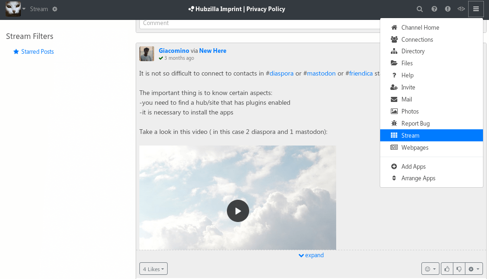

<!--
N.B.: This README was automatically generated by https://github.com/YunoHost/apps/tree/master/tools/README-generator
It shall NOT be edited by hand.
-->

# Hubzilla for YunoHost

[](https://dash.yunohost.org/appci/app/hubzilla)    
[](https://install-app.yunohost.org/?app=hubzilla)

*[Lire ce readme en français.](./README_fr.md)*

> *This package allows you to install Hubzilla quickly and simply on a YunoHost server.
If you don't have YunoHost, please consult [the guide](https://yunohost.org/#/install) to learn how to install it.*

## Overview

Decentralized publication platform and social network.

**Shipped version:** 7.6.1~ynh1

## Screenshots



## Disclaimers / important information

## Installation
Before installing, read the [Hubzilla installation instructions](https://framagit.org/hubzilla/core/blob/master/install/INSTALL.txt) for important information about:

### Register a new domain and add it to YunoHost
- Hubzilla requires a dedicated domain, so obtain one and add it using the YunoHost admin panel. **Domains -> Add domain**. As Hubzilla uses the full domain and is installed on the root, you can create a subdomain such as hubzilla.domain.tld. Don't forget to update your DNS if you manage them manually.

## Ldap Admin user rights, logs and failed database updates

- **For admin rights**: When installation is complete, you will need to visit your new hub's page and login with the **admin account username** which was entered at the time of installation process. You should then be able to create your first channel and have the **admin rights** for the hub.

- **For normal YunoHost users**: Normal LDAP users can login through LDAP authentication and create there channels.

- **Failing to get admin rights**: If the admin cannot access the admin settings at `https://hubzilla.example.com/admin` then you have to **manually add 4096** to the **account_roles** under **accounts** for that user in the **database through phpMyAdmin**.

- **For logs**: Go to **admin->logs** and enter the file name **php.log**.

- **Failed Database after Upgrade:** Some times databse upgrade fails after version upgrade. You can go to hub eg. `https://hubzilla.example.com/admin/dbsync/` and check the numbers of failled update. These updates will have to be ran manually by **phpMyAdmin**.

## Documentation and resources

* Official app website: <https://zotlabs.org/page/hubzilla/hubzilla-project>
* Upstream app code repository: <https://framagit.org/hubzilla/core>
* YunoHost documentation for this app: <https://yunohost.org/app_hubzilla>
* Report a bug: <https://github.com/YunoHost-Apps/hubzilla_ynh/issues>

## Developer info

Please send your pull request to the [testing branch](https://github.com/YunoHost-Apps/hubzilla_ynh/tree/testing).

To try the testing branch, please proceed like that.

``` bash
sudo yunohost app install https://github.com/YunoHost-Apps/hubzilla_ynh/tree/testing --debug
or
sudo yunohost app upgrade hubzilla -u https://github.com/YunoHost-Apps/hubzilla_ynh/tree/testing --debug
```

**More info regarding app packaging:** <https://yunohost.org/packaging_apps>
